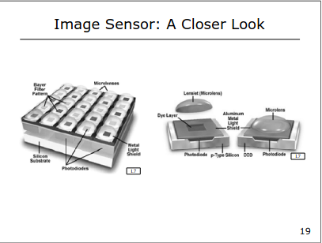

# Image Sensing: From Light to Digital Data

## Overall Goal
The main purpose of this section is to explain the process of **Image Sensing**: how light hitting a camera becomes a digital image (a grid of numbers representing brightness and color) that computers can process.

## 1. Introduction & Need for Digital Images

**Core Concept:** Computer Vision systems need images represented as numerical data (digital images) to analyze them. This covers:
- Journey from light to digital data
- History of image sensing
- Types of sensors (CCD, CMOS)
- Sensor properties (resolution, noise, dynamic range)
- Color capture methods
- Camera's response to light (response function, HDR)
- Natural image sensing (e.g., the eye)

**Intuition:** Computers are good at math and logic but "blind" to the real world. We need to translate the visual world (light) into numbers for computers to "see."

**Example:** When you take a photo with your phone, light enters the lens, then the sensor converts that light pattern into a grid of numbers (the digital image file). Computer vision algorithms can then process these numbers to detect faces or read text in the picture.

## 2. History: Pinhole Camera / Camera Obscura

**Core Concept:** The simplest way to form an image. Light travels in straight lines through a tiny hole in a dark box, creating an inverted image on the opposite wall. Adding a lens instead of a pinhole gathers more light for a brighter image.

**Intuition:** Basic physics of image formation. The tiny hole restricts light rays so only a small bundle from each point reaches the back wall, maintaining spatial arrangement (but inverted). You don't need a complex lens to form an image, just controlled light paths.

**Example:** In a completely dark room on a sunny day, a tiny hole in a window covering creates a faint, upside-down projection of the outside scene on the opposite wall.

## 3. History: Invention of Film

**Core Concept:** Film was revolutionary because it allowed images to be recorded automatically. Light-sensitive chemicals (like silver halide) undergo permanent changes when exposed to light, with the degree of change corresponding to brightness. This creates a "latent" image made visible through chemical development.

**Intuition:** Film is chemical "memory" for light. Where light was bright, chemicals changed significantly; where dark, they changed little or not at all, permanently storing the image pattern.

**Example:** In traditional black and white photography, the film negative is dark where the original scene was bright (lots of chemical change) and clear where it was dark (little change). Printing reverses this to create the final photograph.

## 4. History: Consumer Cameras & Silicon Image Detector

**Core Concept:** Cameras became accessible to the public (Ernemann). The silicon image detector (sensor) was the most significant invention, doing the same job as film but using electronics instead of chemistry. Being reusable, it enabled digital photography, though early digital cameras had low resolution and high power consumption.

**Intuition:** The silicon sensor is film's digital equivalent. Instead of one-time chemical reactions, it uses a reusable physical effect (light generating electrical charge in silicon), making digital cameras and modern computer vision possible.

**Example:** Film is like a notebook you can only write in once. A digital sensor is like a whiteboard – capture an image, read it out, erase it, and repeat.

## 5. History: Smartphones & Basic Silicon Physics

**Core Concept:** Miniaturization put powerful digital cameras into smartphones, leading to massive adoption. The fundamental physics: silicon atoms release electrons when struck by photons with sufficient energy. More intense light means more photons, releasing more electrons. The sensor measures this electron flow.

**Intuition:** Light energy converts to electrical energy (free electrons) in silicon. Light brightness directly corresponds to the number of electrons released. The sensor counts or measures these electrons.

**Example:** A solar panel works similarly but larger scale. Sunlight generates electrical current in silicon. An image sensor does this microscopically at millions of points (pixels) simultaneously, measuring the "electron current" at each point.

## 6. Image Sensor: Pixels, Resolution, and Limits

**Core Concept:** Modern image sensors contain grids of millions of light-sensitive squares (pixels). Resolution refers to the pixel count (e.g., 18 Megapixels = 18 million pixels). While technology allows many pixels, physics imposes limits: pixels smaller than light's wavelength (~500 nanometers) don't improve detail capture due to light's wave nature (diffraction).

**Intuition:** Resolution is like the grid fineness representing the image. More grid squares (pixels) generally means finer detail capture. However, light is fuzzy at small scales. Measuring details smaller than this "fuzziness" doesn't work – you just capture blur. Making pixels infinitely small doesn't indefinitely improve image quality.

**Example:** Trying to measure something smaller than the width of ink used for millimeter markings on a ruler. The ink thickness itself limits precision. Similarly, light's wavelength limits the ultimate detail resolution of any optical system.

## 7. Sensor Type: CCD (Charged-Coupled Device)

**Core Concept:** In CCDs, each pixel collects light-generated electrons in a "potential well" (tiny electronic bucket). For readout, charge from each pixel shifts row by row in a "bucket brigade" until reaching a final row. Charges then shift horizontally to an output node for conversion to voltage, measurement, and digitization.

**Intuition:** CCDs pass collected charge from pixel to pixel until reaching a single, high-quality measurement point. Like an orderly evacuation: each row empties into the next, funneling everything toward one exit. This gives high-quality, low-noise measurements but can be slower due to sequential shifting.

**Example:** Imagine cups collecting rain. To measure each cup, pour the first row's contents into the second row, then the (combined) second row into the third, and so on until all water reaches the last row. Then pour water from the last row, cup by cup, into a measuring cylinder.

## 8. Sensor Type: CMOS (Complementary Metal-Oxide Semiconductor)

**Core Concept:** In CMOS sensors, each pixel has its own amplifier circuit converting collected electrons to voltage right within the pixel. The sensor can read voltage from any specific pixel by addressing it, similar to accessing computer memory cells.

**Intuition:** CMOS puts measurement capability directly into each pixel. Instead of passing buckets, each pixel has a built-in gauge. This allows faster, more flexible readout (e.g., quickly reading just part of the image) since sequential shifting isn't required. The downside: in-pixel circuitry reduces the area dedicated to light collection ("fill factor") compared to CCDs.

**Example:** Rain collection with built-in scales: Each cup has its own measuring scale. You can check any cup whenever you want to see how much rain it collected. No pouring needed. This is faster and lets you check just a few cups if interested in one area.

## 9. Color Sensing (Color Filters) & Microlenses

**Core Concept:** Silicon pixels are colorblind; they only measure light amount, not wavelength (color). For color capture, tiny Red, Green, or Blue filters cover individual pixels in a pattern. Each pixel measures only one color's intensity. Software (demosaicing) later reconstructs the full-color image by interpolating missing color values from neighboring pixels.

**Microlenses:** A tiny lens above each pixel (over the color filter) gathers light falling on the entire pixel area and focuses it onto the light-sensitive region (photodiode), increasing light-gathering efficiency, especially for small pixels.

**Intuition (Color Filters):** Like giving each pixel colored sunglasses. One pixel sees only red light, its neighbor only green, another only blue. The camera's processor combines this patchy color information to determine true color at every point.

**Intuition (Microlenses):** The light-sensitive part of a pixel is a small target. The microlens acts as a funnel, directing light heading toward the general pixel area precisely onto the sensitive spot, rather than hitting non-sensitive areas.

**Example (Color):** Imagine a checkerboard with squares covered by transparent red, green, or blue plastic. Under white light, looking only at a red square shows "red light"; a green square shows "green light." To know the light is actually white (R+G+B mix), you must combine information from differently colored neighboring squares.

**Example (Microlens):** Catching rainwater in a narrow tube is inefficient. Adding a wide funnel catches much more rain falling nearby and directs it into the tube.

## 10. Sensor Cross-Section & Future Trends

**Core Concept:** The sensor has microscopic layers: Microlens on top, then Color Filter, then silicon photodiode (light-sensitive area) and underlying circuitry. Future trends will integrate more processing directly onto the sensor chip, below the light-sensing layers.

**Intuition:** Modern sensors are marvels of micro-engineering, like multi-story buildings shrunk to microscopic size, each floor with a specific function (focusing light, filtering color, converting light to charge, processing). Future sensors will become "smarter," performing basic image analysis on-chip before sending data out.

**Example:** Current sensors are like eyes sending raw signals to the brain. Future sensors might be like eyes that perform basic processing (brightness adjustment, edge detection) before sending refined signals to the main processor.

# Sensor Characteristics: Resolution, Noise, and Dynamic Range

## 1. Resolution

**Core Concept:** Resolution is the total number of pixels that make up the image sensor (and therefore the captured image), often expressed in Megapixels (MP), where 1 MP = 1 million pixels.

**Intuition:** Think of resolution as the number of tiny squares you use to draw a picture on graph paper. More squares (higher resolution) allow you to capture finer details and create sharper-looking images. Fewer squares (lower resolution) mean details get averaged out or lost, leading to blocky or blurry images. Resolution increased dramatically over the years but has plateaued somewhat, as current resolutions are often sufficient for many tasks.

**Example:** An old webcam might have 640x480 pixels (0.3 MP), while a modern smartphone might have 4000x3000 pixels (12 MP). The smartphone image can capture much finer details, like individual leaves on a distant tree, which would just be a green blur on the old webcam image.

## 2. Noise: General Definition

**Core Concept:** Noise is any unwanted random variation or modification added to the image signal that wasn't part of the original scene's light pattern. It degrades image quality.

**Intuition:** Think of noise like static on a radio signal or "snow" on an old analog TV screen. It's interference that obscures the actual music or picture you're trying to receive. In digital images, it appears as random variations in pixel brightness or color. The goal is always to have a strong signal (the actual image information) and low noise.

**Example:** Looking closely at a photo taken in very low light, you'll often see grainy textures or specks of incorrect color, especially in the darker areas. That's image noise.

## 3. Photon Shot Noise

**Core Concept:** This noise arises from the fundamental quantum nature of light. Photons (light particles) arrive at the sensor randomly over time, even if the light source itself is perfectly steady. This randomness in arrival count during the exposure time causes variations in the measured brightness.

**Intuition:** Similar to raindrops - even in a steady rain, the exact number of drops hitting a specific small square of pavement in one second will vary randomly from second to second. Similarly, the exact number of photons hitting a pixel in a short time interval fluctuates.

**Key Property (Poisson Distribution):** This randomness follows a Poisson distribution. A crucial property is that the variance (a measure of the spread or "noisiness") of a Poisson distribution is equal to its mean.

**Implication (Scene Dependent):** Brighter parts of the scene (which have a higher mean number of photons arriving) will naturally have more photon shot noise (higher variance) than darker parts. It's an inherent property of light detection, not a flaw in the sensor itself (though the sensor measures it).

**Example:** Imagine pointing your camera at a perfectly uniform grey card. Even though the card is uniform, the pixels in the resulting image won't have the exact same brightness value. There will be slight random variations around the average grey value due to shot noise. If you photograph a scene with very bright and very dark areas, the shot noise will be quantitatively larger (more variation around the mean) in the bright areas than in the dark areas (though it might be less visible in bright areas).

## 4. Read Noise / Electronic Noise

**Core Concept:** This noise is introduced by the sensor's electronics during the process of converting the collected charge (electrons) into a voltage signal and amplifying it for measurement (before A/D conversion).

**Intuition:** Think of the electronics that read the pixel values as being slightly imperfect or "jittery." Even if a pixel collected exactly 100 electrons, the circuitry might report a voltage corresponding to 98, 101, 100, 99, etc., in different readings. This variation is added by the readout process itself.

**Key Property (Gaussian Distribution):** Often modeled as Gaussian (bell curve) noise. Its level (standard deviation) depends on the quality of the sensor electronics, not the amount of light hitting the pixel.

**Implication (Scene Independent):** Unlike shot noise, read noise is generally constant across the image, regardless of whether an area is bright or dark. It represents the sensor's inherent electronic "noisiness." Higher quality sensors have lower read noise.

**Example:** If you take a picture with the lens cap on (zero light), any variation you see in the pixel values (after accounting for dark current) is primarily due to read noise.

## 5. Quantization Noise

**Core Concept:** This "noise" arises from the process of converting the continuous analog voltage signal into a discrete digital number (using an Analog-to-Digital Converter or ADC). The ADC has a limited number of steps or levels it can use. The difference between the true analog voltage and the closest digital level it gets assigned to is the quantization error.

**Intuition:** Imagine measuring people's heights but only having a ruler marked in whole inches. Someone who is actually 5'9.5" tall would be recorded as either 5'9" or 5'10". This small rounding error is analogous to quantization noise.

**Key Property:** The error is related to the size of the step (Δ) between digital levels. More bits in the ADC (e.g., 12-bit or 14-bit) mean smaller steps and therefore less quantization noise.

**Implication:** In modern cameras with high bit-depth ADCs, quantization noise is usually very small compared to shot noise and read noise, often considered negligible.

**Example:** A very old 8-bit camera could only represent 256 levels of grey. A smooth gradient might look "banded" because the subtle changes in brightness are forced into one of the 256 available steps. A 14-bit camera has 16,384 levels, making the steps much finer and the gradient appear smoother.

## 6. Dark Current Noise

**Core Concept:** Even in complete darkness, thermal energy within the silicon sensor can randomly cause electrons to be generated in the pixels, mimicking a small light signal. This is dark current. The randomness in this electron generation over time is dark current noise.

**Intuition:** Think of it as heat causing tiny "leaks" in the pixel's electron bucket, adding spurious electrons even when no light (photons) is coming in. The warmer the sensor, the more leakage.

**Key Property:** It accumulates over the exposure time. It's usually very low for short exposures but can become significant for very long exposures (minutes), like in astrophotography. It also follows a Poisson distribution (random generation).

**Mitigation:** Cooling the sensor significantly reduces dark current. For typical photography, it's often minor. Professionals sometimes subtract a "dark frame" (an image taken with the lens cap on for the same exposure time and temperature) to estimate and remove the average dark current pattern.

**Example:** An astronomer taking a 5-minute exposure of a faint galaxy might see a noticeable number of bright specks or a general increase in background level caused by accumulated dark current, especially if the camera isn't cooled.

## 7. Fixed Pattern Noise (FPN)

**Core Concept:** This noise arises from tiny, fixed differences in sensitivity or dark current between individual pixels due to manufacturing imperfections. No two pixels are perfectly identical.

**Intuition:** Imagine a factory making millions of tiny light meters (pixels). Some might be slightly more sensitive than others, or have slightly higher leakage (dark current) than others. This difference is fixed for each specific pixel. It's not random from shot to shot like shot noise or read noise.

**Appearance:** If you photograph a perfectly uniform surface, FPN might manifest as a faint, unchanging pattern across the image (often subtle vertical or horizontal lines, or just a consistent variation in pixel response).

**Mitigation:** Because it's fixed, FPN can often be calibrated out. The camera manufacturer (or user) can measure the response of each pixel under uniform illumination and create a correction map to normalize the output, effectively canceling out the fixed variations.

**Example:** In an amplified image, even with uniform input, some pixels consistently read slightly brighter or darker than their neighbors in a fixed pattern, unlike the random speckling of random noise.

## 8. Dynamic Range

**Core Concept:** Dynamic Range describes the ratio between the brightest light intensity a sensor can measure (before it saturates or "clips" to pure white) and the faintest light intensity it can detect above its own noise floor.

**Intuition:** Think of it as the range of brightness the sensor can faithfully capture in a single shot. A scene with very bright highlights (like the sun reflecting off chrome) and very deep shadows (like inside a dark doorway) has a high dynamic range. A sensor with low dynamic range might clip the highlights to white or lose the shadow detail to black (or noise).

**Limits:**
- **Maximum Signal:** Determined by the "full well capacity" – how many electrons a pixel can hold before overflowing (saturating).
- **Minimum Signal:** Determined by the noise (mostly read noise and dark current noise in dark areas) – the signal needs to be strong enough to be distinguishable from this background noise.

**Unit (Decibels - dB):** Uses a logarithmic scale (20 log10(Max / Min)) because the ratios can be very large. Every 6 dB approximately represents a doubling of the ratio (or one "stop" in photography terms).

**Comparison:** The human eye has an enormous dynamic range. Digital cameras have improved greatly but still often lag behind the eye. Video cameras typically have lower dynamic range than still cameras because they use much shorter exposure times per frame, reducing the maximum signal collected relative to the fixed read noise.

**Example:** Taking a photo indoors looking out a bright window. A low dynamic range sensor might show the window as completely blown-out white, or the interior as completely black. A high dynamic range sensor (or HDR techniques) can capture detail both inside the room and outside the window simultaneously. A typical digital still camera might capture a brightness range of about 4000:1 (72 dB).

