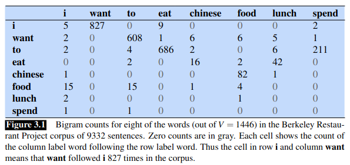
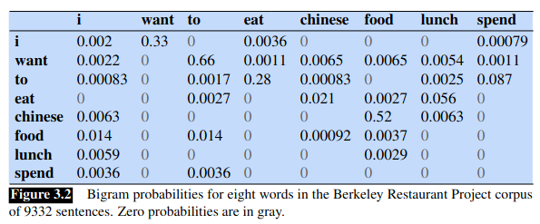
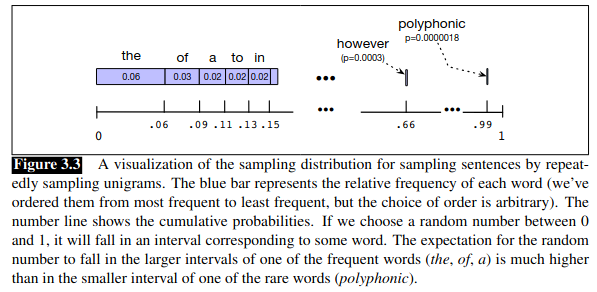
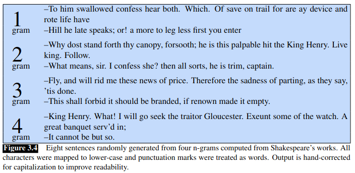
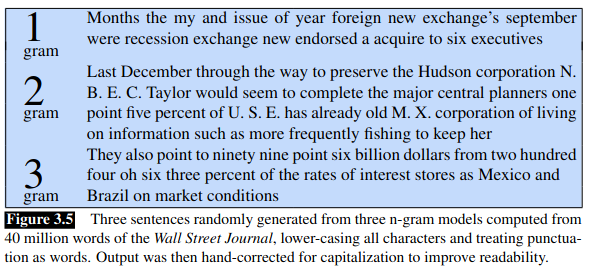
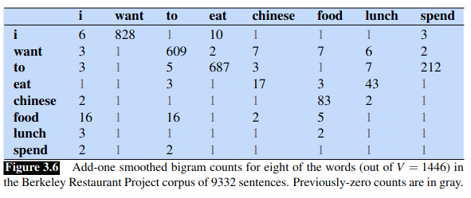
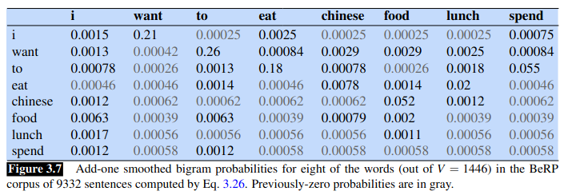
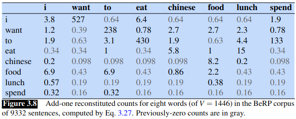

# Chapter 3 - N-gram Language Models

## Introduction to Language Models (LMs)

*   **Definition:** A **Language Model (LM)** is a machine learning model that predicts upcoming words. More formally, it assigns a probability distribution over possible next words given a history, `P(w | h)`.
*   **Functionality:**
    *   Predicts the probability of the *next word* in a sequence.
    *   Assigns a probability to an *entire sequence* of words, indicating how likely that sequence is.
    *   Example: `P("all of a sudden I notice...") > P("on guys all I of notice...")`
*   **Why are LMs useful?**
    *   **Generation & Correction:** Improving contextual word choice (e.g., grammar/spelling correction: `There are` is more probable than `Their are`; `has improved` more probable than `has improve`).
    *   **Evaluation:** Scoring the likelihood of sequences (e.g., in speech recognition: `I will be back soonish` is more probable than `I will be bassoon dish`).
    *   **Assistive Technology:** Augmentative and Alternative Communication (AAC) systems use word prediction to suggest likely words for users.
    *   **Foundation of Modern NLP:** Training large models *solely* on the task of word prediction (as seen in Chapters 7-9) allows them to learn vast amounts about language structure and meaning. **Large Language Models (LLMs)** are built this way.

## N-grams

*   **Definition (Sequence):** An **n-gram** is a contiguous sequence of *n* words from a text.
    *   **Bigram (2-gram):** Two-word sequence (e.g., "The water", "water of").
    *   **Trigram (3-gram):** Three-word sequence (e.g., "The water of").
*   **Definition (Model):** An **n-gram language model** uses the previous `n-1` words to estimate the probability of the next word `P(wn | wn-N+1:n-1)`. It's a probabilistic model based on n-gram sequences. *(Note the terminological ambiguity mentioned in the text)*.
*   **Focus:** This chapter introduces n-gram models as a foundation before moving to more powerful neural LMs later. They clearly illustrate concepts like training/test sets, perplexity, sampling, etc.

## 3.1 N-Grams: Estimating Probabilities

### The Challenge: Predicting from History

*   Goal: Calculate `P(w | h)`, the probability of word `w` given history `h`.
*   **Direct Estimation Idea:** Use relative frequency counts from a large corpus:
    `P(w | h) = C(h w) / C(h)`
    (Count occurrences of history `h` followed by word `w`, divided by count of history `h`).
*   **Problem: Data Sparsity:** Language is creative. Most long histories `h` (like entire sentences) will have occurred 0 or 1 times even in massive corpora (like the web). Direct estimation is impossible for long histories.

### The Solution: Probability Chain Rule & Markov Assumption

*   **Chain Rule of Probability:** Decomposes the joint probability of a sequence into conditional probabilities:
    `P(w1:n) = P(w1) * P(w2 | w1) * P(w3 | w1:2) * ... * P(wn | w1:n-1)`
    `P(w1:n) = Π (from k=1 to n) P(wk | w1:k-1)`
    *   This links joint probability to the conditional probabilities we need, but doesn't solve the sparsity problem for `P(wn | w1:n-1)`.

*   **Markov Assumption:** The core simplification for n-gram models. Assume the probability of the next word depends *only* on a limited window of `N-1` preceding words, not the entire history.
    `P(wn | w1:n-1) ≈ P(wn | wn-N+1 : n-1)`
    *   **Bigram Model (N=2):** Assumes probability depends only on the *previous one* word.
        `P(wn | w1:n-1) ≈ P(wn | wn-1)`
        Example: `P(blue | The water ... beautifully) ≈ P(blue | beautifully)`
    *   **Trigram Model (N=3):** Assumes probability depends only on the *previous two* words.
        `P(wn | w1:n-1) ≈ P(wn | wn-2 : n-1)`

*   **Sequence Probability with Markov Assumption (Bigram Example):**
    By substituting the bigram assumption into the chain rule:
    `P(w1:n) ≈ Π (from k=1 to n) P(wk | wk-1)` (where `P(w1|w0)` is defined as `P(w1|<s>)`)

### Maximum Likelihood Estimation (MLE) for N-gram Probabilities

*   **MLE Principle:** Estimate model parameters (the probabilities) by using the **relative frequencies** observed in a training corpus. These are the probabilities that maximize the likelihood of observing the training data.
*   **Normalization:** Ensure probabilities are valid (between 0 and 1, and sum to 1 for all possible next words). This is done by dividing the count of a specific n-gram by the total count of its prefix (context).

*   **Bigram MLE Formula:**
    `P(wn | wn-1) = C(wn-1 wn) / Σ_w C(wn-1 w)`
    Since `Σ_w C(wn-1 w)` (sum of counts of all bigrams starting with `wn-1`) is just the count of the unigram `wn-1`, this simplifies to:
    `P(wn | wn-1) = C(wn-1 wn) / C(wn-1)`

*   **General N-gram MLE Formula:**
    `P(wn | wn-N+1:n-1) = C(wn-N+1 : n-1 wn) / C(wn-N+1 : n-1)`
    (Count of the full n-gram divided by the count of the `n-1` gram prefix/history).

*   **Example MLE Intuition:** If "Chinese" appears 400 times in a 1M word corpus, the MLE probability `P(Chinese)` is 400/1,000,000 = 0.0004. This is the probability that best explains seeing "Chinese" 400 times in that specific corpus.

### Practical Considerations & Example

*   **Start/End Symbols:** Sentences are typically augmented with special symbols:
    *   `<s>`: Start-of-sentence symbol. Provides context for the first word (e.g., allows calculation of `P(word1 | <s>)`).
    *   `</s>`: End-of-sentence symbol. Ensures the model defines a true probability distribution where probabilities sum to 1 across all possible sentences.
*   **Mini-Corpus Example:**
    `<s> I am Sam </s>`
    `<s> Sam I am </s>`
    `<s> I do not like green eggs and ham </s>`
    *   `C(<s>)` = 3
    *   `C(I)` = 3 (as first word or internal)
    *   `C(<s> I)` = 2
    *   `C(I am)` = 2
    *   Calculations:
        *   `P(I | <s>) = C(<s> I) / C(<s>) = 2 / 3 ≈ 0.67`
        *   `P(Sam | <s>) = C(<s> Sam) / C(<s>) = 1 / 3 ≈ 0.33`
        *   `P(am | I) = C(I am) / C(I) = 2 / 3 ≈ 0.67`
        *   `P(do | I) = C(I do) / C(I) = 1 / 3 ≈ 0.33`
        *   ...and so on.

*   **Berkeley Restaurant Project Example (Figures 3.1 & 3.2):**
    *   Shows real bigram counts and probabilities.
    *   Highlights data **sparsity** (many zero counts/probabilities).
    *   Demonstrates calculating sentence probability by multiplying bigram probabilities:
        `P(<s> i want english food </s>) = P(i|<s>) * P(want|i) * P(english|want) * P(food|english) * P(</s>|food)`
        `= 0.25 * 0.33 * 0.0011 * 0.5 * 0.68 ≈ 0.000031`

### What N-grams Capture

*   Bigram probabilities can encode various linguistic and contextual facts:
    *   **Syntax:** Likelihood of word categories following others (e.g., nouns after adjectives, verbs after 'to').
    *   **Task/Domain Specifics:** Frequent starting words ('I' in a personal assistant task).
    *   **Semantic/World Knowledge (Implicitly):** Higher probability of "Chinese food" vs. "English food" in the Berkeley context.

## 3.1.3 Dealing with Scale in Large N-gram Models

Working with large n-gram models in practice introduces several computational and storage challenges.

*   **Log Probabilities:**
    *   **Problem:** Multiplying many small probabilities (which are ≤ 1) together can lead to **numerical underflow** (the result becomes too small to represent accurately with standard floating-point numbers).
    *   **Solution:** Perform all calculations and storage in **log space**.
        *   Store `log P(w | h)` instead of `P(w | h)`.
        *   Since `log(a * b) = log(a) + log(b)`, multiplying probabilities in linear space is equivalent to *adding* log probabilities in log space.
        *   `p1 * p2 * ... * pn = exp(log p1 + log p2 + ... + log pn)`
    *   **Benefit:** Adding log probabilities (which are negative numbers) avoids extremely small values and maintains numerical stability.
    *   **Convention:** Unless specified, `log` typically refers to the **natural logarithm (ln)**.
    *   **Conversion:** To get back the actual probability from a log probability, compute `exp(log_prob)`.

    💡 **Tip: Why Log Probabilities?** Imagine calculating the probability of a 20-word sentence. If each word has a probability around 0.1, the total probability is 0.1^20 = 1e-20, a very small number prone to underflow. In log space (base e), log(0.1) ≈ -2.3. The sum of 20 such log probs is ≈ -46, a much more manageable number.

*   **Longer Context (Higher N):**
    *   While bigrams (N=2) are simple, **trigrams (N=3)**, **4-grams**, or **5-grams** are often used when sufficient training data is available, as they capture longer-range dependencies.
    *   **Padding:** Need to handle contexts at the beginning of sentences. For an N-gram model, `N-1` start symbols (`<s>`) are typically used.
        *   Trigram (N=3): Need context `wn-2 wn-1`. For the first word `w1`, use `P(w1 | <s> <s>)`. For the second word `w2`, use `P(w2 | <s> w1)`.
*   **Large N-gram Datasets:**
    *   Examples of publicly available large n-gram count datasets:
        *   **COCA N-grams:** From 1 billion words (Contemporary American English).
        *   **Google Web 5-gram:** From 1 trillion words (English web text).
        *   **Google Books N-grams:** From 800 billion tokens across multiple languages.
*   **Very Long Context (Infini-gram / ∞-gram):**
    *   Recent research (Liu et al., 2024) avoids pre-computing huge n-gram tables.
    *   Uses efficient data structures (like **suffix arrays**) to compute n-gram probabilities for *arbitrary* `n` quickly at inference time.
    *   Allows leveraging extremely long contexts from massive corpora (e.g., 5 trillion tokens).

*   **Efficiency Considerations for Large Models:**
    *   **Quantization:** Store probabilities using fewer bits (e.g., 4-8 bits) instead of full precision floats (e.g., 64 bits) to save space.
    *   **Word Representation:** Store full word strings on disk but use compact representations (e.g., 64-bit hashes) in memory.
    *   **Data Structures:** Use specialized structures like **tries** (often reverse tries for LM context lookup) for efficient storage and retrieval of n-grams.
    *   **Pruning:** Remove less useful n-grams to reduce model size. Methods include:
        *   **Thresholding:** Keep only n-grams with counts above a certain value.
        *   **Entropy-based Pruning:** Remove n-grams that contribute less information (Stolcke, 1998).
    *   **Efficient Toolkits:** Software like **KenLM** (Heafield et al.) uses optimized techniques (e.g., sorted arrays, merge sorts) to build large models efficiently from huge corpora with minimal disk passes.

    🤔 **Understanding Efficiency:** Building LMs from billions or trillions of words requires careful engineering. Standard programming approaches might be too slow or use too much memory. Techniques like quantization, hashing, tries, and pruning are essential for making large n-gram models practical.

## 3.2 Evaluating Language Models: Training and Test Sets

Evaluating how well a language model performs is crucial. There are two main approaches:

### 1. Extrinsic Evaluation

*   **Definition:** Evaluating a model by embedding it within a larger application and measuring the improvement in that application's performance.
*   **Method:** Run the end-to-end system (e.g., speech recognizer, machine translator) twice: once with LM A and once with LM B. Compare the final task metric (e.g., Word Error Rate, BLEU score).
*   **Pros:** Measures the *actual utility* of the LM for the specific task. The "gold standard" evaluation.
*   **Cons:** Can be very slow, expensive, and complex to set up and run repeatedly.

### 2. Intrinsic Evaluation

*   **Definition:** Evaluating the quality of the model based on its own characteristics, independent of any specific application.
*   **Method:** Measures how well the model fits some held-out data, typically using metrics calculated directly from the model's probabilities (like **perplexity**, introduced next).
*   **Pros:** Faster, cheaper, easier for rapid iteration and comparison during model development.
*   **Cons:** Improvement in intrinsic metrics doesn't *guarantee* improvement in a downstream extrinsic task (though usually correlated).

### The Need for Separate Datasets

*   To get an unbiased assessment of how well a model **generalizes** to new, unseen data, we *must* evaluate it on data it wasn't trained on.
*   Standard practice involves splitting available data into three distinct sets:

    1.  **Training Set:**
        *   **Purpose:** Used to *learn* the model's parameters.
        *   **N-grams:** The corpus from which n-gram counts are collected and probabilities are estimated (via MLE).
        *   **Goal:** Maximize the amount of data available for learning patterns.

    2.  **Test Set:**
        *   **Purpose:** Used *only* for the **final evaluation** of the trained model's performance on unseen data. Provides an unbiased estimate of generalization ability.
        *   **Characteristics:**
            *   Must be **held-out** (no overlap with the training set).
            *   Should reflect the *actual data distribution* the model will encounter in its final application (e.g., chemistry lectures if the model is for that domain).
            *   For general models, should be diverse.
        *   **Usage:** Ideally touched only once or very few times at the very end of the development cycle.

    3.  **Development Set (Dev Set / Validation Set):**
        *   **Purpose:** Used *during* model development as a **proxy for the test set**. Used for:
            *   Tuning hyperparameters (like the value of 'n' in n-grams, or settings for smoothing algorithms).
            *   Comparing different model architectures or variations.
            *   Making decisions about model design *without* repeatedly using the test set.
        *   **Characteristics:**
            *   Must be held-out (no overlap with training or test sets).
            *   Should be drawn from the *same distribution* as the test set.

    💡 **Tip: The Golden Rule of Separation:** Never, ever train your model parameters on the test set or the development set. These sets are *only* for evaluation.

### How to Evaluate (Intrinsic Principle)

*   The core principle for intrinsic evaluation: **A better language model assigns a higher probability to the unseen test data.**
*   The model that better predicts the sequences in the test set is considered superior.

### Critical Pitfalls

*   **Training on the Test Set:**
    *   **Definition:** Accidentally including test set data in the training corpus.
    *   **Consequence:** Leads to **artificially inflated** performance metrics (probabilities will look too high, perplexity too low). The model appears better than it actually is because it has "cheated" by seeing the evaluation data during training. This gives a completely biased and useless evaluation.
    *   **MUST BE AVOIDED.**
*   **Over-tuning on the Dev Set:**
    *   While necessary, repeatedly testing and modifying the model based *only* on dev set performance can lead the model to become overly specialized to the quirks of that specific dev set.
    *   This might slightly reduce its performance on the final, truly unseen test set.
    *   This is why the final test set evaluation is crucial.

### Data Splitting Strategy

*   **Goal:** Balance having enough training data with having reliable dev/test sets.
*   **Representativeness:** Ensure dev and test sets accurately reflect the target data distribution. Avoid systematic biases (e.g., test set containing only one author/topic if the model should be general).
*   **Size:** Test/Dev sets should be large enough for statistically meaningful comparisons between models.

## 3.3 Evaluating Language Models: Perplexity

### Recap: Evaluating Based on Probability

*   The fundamental principle for intrinsic evaluation: A better LM should assign a **higher probability** to unseen test data.
*   A model that predicts upcoming words well will be less "surprised" by the test set, assigning it higher likelihood.

### The Problem with Raw Probability

*   The raw probability `P(W)` of a test set `W = w1...wN` depends heavily on its length `N`.
*   Longer sequences naturally have lower probabilities (multiplying many numbers < 1).
*   This makes direct comparison of probabilities across test sets of different lengths difficult.

### Perplexity (PPL): The Standard Intrinsic Metric

*   **Definition:** **Perplexity (PP or PPL)** is a measure of how well a probability model predicts a sample. It's normalized for sequence length and inversely related to the probability assigned by the model.
*   **Calculation:** It is the **inverse probability** of the test set, normalized by the number of words (`N`) using the Nth root.
    `perplexity(W) = P(w1 w2 ... wN)^(-1/N)`
    `perplexity(W) = N√ (1 / P(w1 w2 ... wN))` (Eq 3.14)
*   **Using the Chain Rule:**
    `perplexity(W) = N√ Π (from i=1 to N) [ 1 / P(wi | w1...wi-1) ]` (Eq 3.15)
*   **Key Relationship:**
    *   **Lower Perplexity = Higher Probability = Better Model.**
    *   Minimizing perplexity is equivalent to maximizing the test set probability.

    💡 **Tip: Inverse Relationship:** Remember: Low perplexity is good! It means the model was less "perplexed" or "surprised" by the test data, indicating it assigned a higher probability to the observed sequence.

### Calculating Perplexity for N-gram Models

*   The exact calculation uses the specific conditional probabilities defined by the model:
    *   **Unigram Perplexity:**
        `perplexity(W) = N√ Π (from i=1 to N) [ 1 / P(wi) ]` (Eq 3.16)
    *   **Bigram Perplexity:**
        `perplexity(W) = N√ Π (from i=1 to N) [ 1 / P(wi | wi-1) ]` (Eq 3.17)
    *   *(General N-gram): Uses P(wi | wi-N+1...wi-1) inside the product.*
*   **Handling Sentence Boundaries:**
    *   If the vocabulary includes sentence boundary tokens (`<s>`, `</s>`), these are included in the probability calculation `P(W)`.
    *   When counting the total number of tokens `N` for normalization, include one token per sentence (typically the `</s>` token, but *not* the `<s>` token). *Reason: P(<s> | </s>) is usually close to 1 and doesn't reflect model quality.*

### Comparing Models using Perplexity

*   Perplexity depends on both the **model** and the **test set**.
*   It allows comparison of different models *on the same test set*.
*   **Example (WSJ Corpus):**
    | Model   | Perplexity |
    | :------ | :--------- |
    | Unigram | 962        |
    | Bigram  | 170        |
    | Trigram | 109        |
    *   **Observation:** As the n-gram order increases (more context), the model predicts better, assigns higher probability to the test set, and thus achieves **lower perplexity**.

### Important Caveats for Perplexity

1.  **No Training on Test Set:** The model MUST NOT have seen the test set during training. Any overlap leads to artificially low (and invalid) perplexity scores.
2.  **Identical Vocabularies:** Perplexity scores are only comparable between models that use the **exact same vocabulary**. Changing the vocabulary changes the probability space.
3.  **Intrinsic vs. Extrinsic:** Lower perplexity *usually* correlates with better performance on downstream tasks (extrinsic evaluation), but it's **not guaranteed**. Always confirm with end-to-end evaluation if possible.

### Perplexity as Weighted Average Branching Factor

*   **Alternative Interpretation:** Perplexity can be thought of as the **average number of choices** the model has when deciding the next word, weighted by probability.
*   **Branching Factor:** In a simple language, the number of possible words that can follow any given word.
    *   Example Language L = {red, blue, green}. Branching factor = 3.
*   **Uniform Distribution:** If all choices are equally likely (e.g., `P(red)=P(blue)=P(green)=1/3`), then `Perplexity = Branching Factor`.
    *   Test set T = "red red red red blue". PPL = ( (1/3)^5 )^(-1/5) = (1/3)^(-1) = 3.
*   **Non-Uniform Distribution:** If some choices are more likely, the weighted average branching factor (perplexity) decreases, reflecting higher predictability.
    *   Model B: `P(red)=0.8`, `P(green)=0.1`, `P(blue)=0.1`. Branching factor is still 3.
    *   Test set T = "red red red red blue". PPL = (0.8 * 0.8 * 0.8 * 0.8 * 0.1)^(-1/5) = (0.04096)^(-1/5) ≈ 1.89.
    *   **Intuition:** Since 'red' is highly probable, the model is less "perplexed" most of the time, leading to a lower average branching factor (perplexity) than the theoretical maximum of 3.

    🤔 **Understanding Branching Factor:** A lower perplexity suggests the model has learned the patterns in the language well enough to narrow down the likely choices for the next word significantly, on average.

## 3.4 Sampling Sentences from a Language Model

*   **Definition:** **Sampling** from a language model means generating sentences randomly, where the probability of generating a particular sentence is determined by the probabilities assigned by the language model itself.
*   **Purpose:** A useful technique (suggested early by Shannon, Miller & Selfridge) to **visualize the knowledge** captured by an LM. By looking at the generated sentences, we can get an intuition for the patterns, biases, and common sequences the model has learned. High-probability sequences according to the model should be generated more often than low-probability ones.

### Sampling Process (Unigram Example)

1.  **Conceptualize:** Imagine the entire vocabulary laid out on a number line from 0 to 1. Each word `w` occupies an interval of length `P(w)` (its unigram probability). Frequent words get larger intervals, rare words get smaller ones (See Fig 3.3).
2.  **Generate Random Number:** Choose a random floating-point number uniformly between 0 and 1.
3.  **Select Word:** Find which word's interval the random number falls into. Output that word.
4.  **Repeat:** Continue generating random numbers and selecting words until the end-of-sentence token (`</s>`) is generated.

    💡 **Tip: Unigram Sampling:** This process generates words independently based only on their overall frequency. The resulting "sentences" are often grammatically incoherent sequences reflecting word frequencies, not context. E.g., "the of a to the the ..."

### Sampling Process (Bigram Example)

1.  **Start:** Sample the first word `w1` based on the initial bigram probabilities `P(w1 | <s>)`. (Use the same number line technique, but the intervals are defined by `P(w | <s>)`).
2.  **Next Word:** Let the previously generated word be `wi-1`. Sample the next word `wi` based on the conditional bigram probabilities `P(wi | wi-1)`. (Conceptually, for the context `wi-1`, imagine a *new* number line from 0 to 1 where each possible next word `w` occupies an interval of length `P(w | wi-1)`).
3.  **Repeat:** Continue sampling the next word based on the conditional probability given the *immediately preceding* word, until `</s>` is generated.

    💡 **Tip: Bigram Sampling:** Sentences generated using bigrams tend to show more local coherence than unigram samples because each word choice depends on the previous one. They might look more "sentence-like" locally but still lack long-range coherence. The example opening quote ("You are uniformly charming! cried he...") was generated from a *trigram* model, showing even better local structure.

*   **General N-gram Sampling:** The process extends naturally. To sample `wi`, use the conditional probability `P(wi | wi-N+1 ... wi-1)` based on the `N-1` previously generated words.

## 3.5 Generalizing vs. Overfitting the Training Set

*   **Training Data Dependency:** N-gram models (like many statistical models) are highly dependent on the specific corpus they are trained on. Their probabilities reflect the patterns and idiosyncrasies of that data.
*   **Effect of Increasing N:** As the order `N` of the n-gram increases:
    *   The model incorporates more context.
    *   It becomes better at modeling the **training corpus**.
    *   Generated samples become more coherent and closely resemble the style of the training data.

*   **Visualization via Sampling (Examples):**
    *   **Shakespeare Corpus (Fig 3.4):**
        *   Unigram: Incoherent words based on frequency.
        *   Bigram: Some local word pairs make sense.
        *   Trigram: Starts to sound recognizably Shakespearean.
        *   4-gram: Looks very much like Shakespeare, potentially *too much*.
    *   **Wall Street Journal (WSJ) Corpus (Fig 3.5):**
        *   Generates text characteristic of news/financial writing.
        *   No overlap with Shakespeare samples, highlighting strong genre dependence.

*   **Overfitting:**
    *   When `N` is large relative to the size and diversity of the training data, the model may start to **memorize** specific sequences from the training set instead of learning generalizable patterns.
    *   **Example:** The 4-gram Shakespeare model generated "It cannot be but so," a direct quote from King John. This happens because, given the limited Shakespeare corpus (N ≈ 885k words, V ≈ 29k), once the 3-gram "It cannot be" is generated, there are very few observed next words in the training data.
    *   **Problem:** An overfit model performs well on data identical to the training set but poorly on new, unseen data, even if it's from the same general domain. It fails to **generalize**.

*   **The Generalization Challenge:**
    *   Models trained on one domain/genre (e.g., Shakespeare) perform poorly when tested on a different domain (e.g., WSJ). The n-gram statistics are completely different.
    *   **Conclusion:** Statistical models are less useful if the training and test distributions differ significantly.

*   **Addressing the Generalization Problem:**
    1.  **Match Training Data to Task:** This is crucial.
        *   Use a training corpus similar in genre, domain, and style to the target application. (e.g., legal documents for legal LM, questions for QA LM).
        *   Ensure the training data includes the relevant **dialect or variety** (e.g., African American English (AAE) features like `finna` or `den` for `then`, Nigerian Pidgin vocabulary) if the model needs to process text from those communities (especially important for social media, spoken transcripts).
    2.  **(Implicit) Handling Unseen Words via Subword Tokenization:**
        *   **Problem Revisit:** What if a word (e.g., "Jurafsky") appears in the test set but never in training?
        *   **Modern Solution:** NLP systems often operate on **subword tokens** (from BPE, etc.), not raw words.
        *   **Benefit:** Even if a *word* is unseen, it can almost always be represented as a sequence of *known subword tokens* (potentially down to individual letters, which are always in the vocabulary).
        *   **Implication:** The problem of "unknown words" at the vocabulary level is largely mitigated by subword tokenization, although the *sequence* of subwords might still be novel and have low probability.

    💡 **Tip: Corpus is King:** The quality and relevance of the training data are paramount for building useful n-gram (and other statistical) models. Matching the training data distribution to the expected test/application data distribution is critical for generalization. Subword tokenization helps ensure vocabulary coverage, but domain/style matching remains essential.

## 3.6 Smoothing, Interpolation, and Backoff

### The Problem of Zeros

*   **Maximum Likelihood Estimation (MLE) Issue:** MLE assigns a probability of zero to any n-gram that was *not* seen in the training corpus.
*   **Zeros:** N-grams that have a zero count in the training data but might realistically occur in new (test) data. (e.g., "ruby slippers" might not be in training, but is a valid phrase).
*   **Consequences of Zeros:**
    1.  **Underestimation:** The model underestimates the probability of perfectly valid sequences containing unseen n-grams. This hurts performance on any downstream task.
    2.  **Perplexity Calculation Failure:** If any required n-gram probability in the test set calculation is zero, the overall probability of the test set becomes zero. Since perplexity involves `1 / P(W)`, it becomes infinite (division by zero), making evaluation impossible.

### Smoothing (or Discounting)

*   **Definition:** Techniques used to adjust low-probability counts (especially zeros) upwards and high-probability counts downwards.
*   **Goal:** To assign some non-zero probability mass to *all* possible events (even unseen ones), ensuring the model can handle novel n-grams in the test data and that perplexity can be calculated.
*   **Mechanism:** "Shave off" or **discount** some probability mass from frequent, seen n-grams and redistribute it to infrequent or unseen n-grams.
*   **Techniques Introduced:** Laplace smoothing, stupid backoff, interpolation.

### 3.6.1 Laplace Smoothing (Add-One Smoothing)

*   **Concept:** The simplest smoothing method. Add one to *every* n-gram count before normalizing to calculate probabilities.
*   **Usefulness:** Introduces core smoothing concepts, provides a baseline, practical for some other tasks (like text classification - Ch 4), but **not effective enough for modern n-gram LMs**.

*   **Unigram Laplace Smoothing:**
    *   Recall MLE: `P(wi) = ci / N`
    *   Laplace Formula: `PLaplace(wi) = (ci + 1) / (N + V)` (Eq 3.24)
    *   **Explanation:**
        *   `ci + 1`: Add one to the count of word `wi`.
        *   `N + V`: The original total word count `N` is increased by `V` (the vocabulary size) because we added 1 to the count of *each* of the `V` unique word types. This ensures the probabilities still sum to 1.

*   **Bigram Laplace Smoothing:**
    *   Recall MLE: `PMLE(wn | wn-1) = C(wn-1 wn) / C(wn-1)` (Eq 3.25)
    *   Laplace Formula: `PLaplace(wn | wn-1) = (C(wn-1 wn) + 1) / (C(wn-1) + V)` (Eq 3.26)
    *   **Explanation:**
        *   `C(wn-1 wn) + 1`: Add one to the count of the specific bigram.
        *   `C(wn-1) + V`: The count of the preceding word `wn-1` (which is `Σw C(wn-1 w)`) is effectively increased by `V`, because we added 1 to the count of *each* of the `V` possible bigrams starting with `wn-1`.
    *   **Example:** See Fig 3.6 for smoothed counts and Fig 3.7 for smoothed probabilities for the Berkeley Restaurant Project data.

*   **Adjusted Counts (Visualization):**
    *   To understand the impact of smoothing, we can calculate an "adjusted count" `C*` that represents the smoothed probability relative to the original unigram count.
    *   `C*(wn-1 wn) = [C(wn-1 wn) + 1] * C(wn-1) / (C(wn-1) + V)` (Eq 3.27)
    *   This allows comparing the *effective* counts after smoothing with the original MLE counts. (See Fig 3.8).

*   **Critique of Laplace Smoothing:**
    *   It drastically alters the original counts and probabilities (See example: `C(want to)` changed from 608 to an effective count `C*` of 238).
    *   **Problem:** It moves *far too much* probability mass from the actually observed n-grams to the vast number of zero-count n-grams. In a typical vocabulary, most possible bigrams will have zero counts, and giving each of them a count of 1 steals too much probability from the ones we actually saw.
    *   **Result:** Poor performance compared to more sophisticated smoothing methods.

    💡 **Tip: Why Add-One is Usually Bad for LMs:** Imagine V=30,000. For a given word `w`, you add 1 to `30,000` possible bigrams `(w, x)`. This means you add `30,000` to the denominator `C(w) + V`. This drastically reduces the probability allocated to the bigrams you *actually observed* starting with `w`.

### 3.6.2 Add-k Smoothing

*   **Concept:** A variation of Add-one smoothing where instead of adding 1, a smaller fractional value `k` (e.g., 0.5, 0.01) is added to each count.
*   **Goal:** To mitigate the problem of Add-one moving too much probability mass to zero counts.
*   **Formula (Bigram Example):**
    `P_Add-k(wn | wn-1) = (C(wn-1 wn) + k) / (C(wn-1) + k * V)` (Eq 3.28)
    *   `k`: The fractional count added (0 < k).
    *   `V`: Vocabulary size.
*   **Choosing `k`:** The value of `k` is a hyperparameter, often chosen by optimizing performance (e.g., minimizing perplexity) on a **development set**.
*   **Effectiveness:** While better than Add-one, Add-k smoothing still performs poorly for language modeling tasks. It can lead to counts with poor statistical properties (variances) and may still apply inappropriate discounts (Gale and Church, 1994). Generally **not recommended** for modern n-gram LMs.

### 3.6.3 Language Model Interpolation

*   **Concept:** Combine information from different n-gram orders (e.g., trigram, bigram, unigram) to estimate the probability, rather than relying solely on the highest order available.
*   **Motivation:** Lower-order n-grams (like unigrams or bigrams) are estimated from more data and can provide more robust estimates when higher-order n-gram counts are sparse or zero.
*   **Method: Simple Linear Interpolation:** Calculate the probability as a weighted average of the probabilities from different orders.
    *   **Formula (Trigram Example):**
        `P_hat(wn | wn-2 wn-1) = λ1 * P(wn) + λ2 * P(wn | wn-1) + λ3 * P(wn | wn-2 wn-1)` (Eq 3.29)
    *   **Weights (`λ`):**
        *   `λ1`, `λ2`, `λ3` are non-negative weights.
        *   Must sum to 1: `λ1 + λ2 + λ3 = 1`.
*   **Method: Context-Conditioned Interpolation:** Allow the `λ` weights to depend on the context (`wn-2 wn-1`).
    *   **Formula (Trigram Example):**
        `P_hat(wn | wn-2 wn-1) = λ1(context) * P(wn) + λ2(context) * P(wn | wn-1) + λ3(context) * P(wn | wn-2 wn-1)` (Eq 3.30)
    *   **Intuition:** If the context `wn-2 wn-1` has been seen frequently (making `P(wn | wn-2 wn-1)` reliable), assign a higher `λ3(context)`. If the context is rare, rely more on lower-order models by increasing `λ1(context)` and `λ2(context)`.
*   **Learning Lambda Weights:**
    *   The `λ` values (interpolation weights) are **learned** (tuned) using a **held-out** dataset (a portion of the training data set aside, distinct from the final test set).
    *   **Objective:** Find the `λ` values that maximize the probability (or minimize the perplexity) of this held-out data according to the interpolated model.
    *   **Method:** Algorithms like the **Expectation-Maximization (EM) algorithm** can be used to find optimal `λ` values.

    💡 **Tip: Interpolation vs. Backoff:** Interpolation *always* mixes probabilities from different orders. Backoff (discussed next, and less common now) typically only uses lower orders if the higher order has zero counts.

### 3.6.4 Stupid Backoff

*   **Concept:** A simplified **backoff** strategy commonly used in large-scale language models.
*   **Backoff Idea:** If the desired n-gram has zero count, "back off" and use the probability estimate from the (n-1)-gram, potentially continuing down to the unigram.
*   **Traditional Backoff (e.g., Katz):** Requires careful **discounting** of higher-order probabilities to reserve probability mass for the lower-order estimates, ensuring the final model is a valid probability distribution (sums to 1). (Not detailed in this text).
*   **Stupid Backoff (Brants et al., 2007):**
    *   **Simplification:** **Does NOT perform discounting** and therefore **does NOT produce a valid probability distribution** (scores don't sum to 1).
    *   **Mechanism:**
        1.  If the count of the desired n-gram `count(wn-N+1 ... wn)` is greater than 0, use its relative frequency estimate: `count(N-gram) / count(Prefix)`.
        2.  If the count is 0, back off to the score of the (N-1)-gram `S(wn | wn-N+2 ... wn-1)`, multiplied by a fixed backoff factor `λ`.
    *   **Formula (Score `S`):**
        `S(wi | context_N-1) = P_MLE(wi | context_N-1)` if `count(context_N-1, wi) > 0`
        `S(wi | context_N-1) = λ * S(wi | context_N-2)` otherwise (Eq 3.31)
    *   **Base Case:** The backoff stops at the unigram score: `S(w) = count(w) / N_total_words`.
    *   **Backoff Factor (`λ`):** A fixed weight, typically less than 1 (e.g., `λ = 0.4` suggested by Brants et al.). It's context-independent.
*   **Pros & Cons:**
    *   **Pros:** Very simple, computationally efficient, performs surprisingly well for very large datasets.
    *   **Cons:** Does not yield true probabilities.

    🤔 **Why "Stupid"?** The name reflects its simplicity and abandonment of the complex discounting required for theoretically sound probability distributions in traditional backoff models like Katz backoff. Despite this, it proved effective and efficient.
